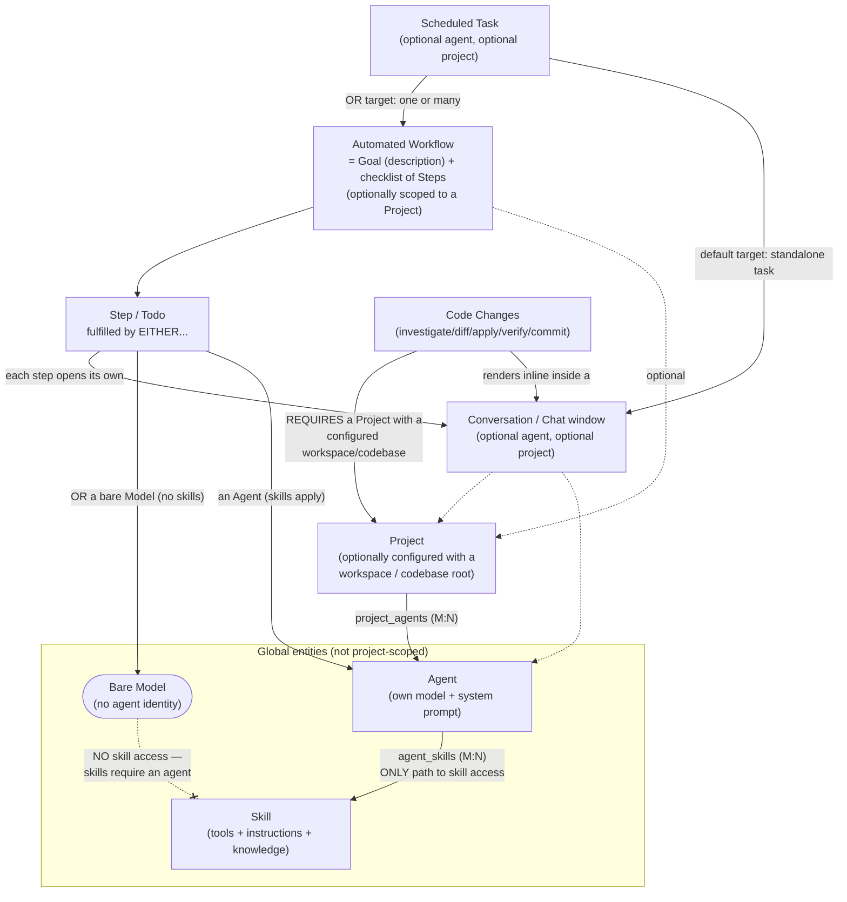

# Nexy Domain Model — Hierarchy & Automated Workflow Restructure Roadmap

Status: **research/design source doc — the roadmap it describes has been fully implemented.** This document itself is unchanged from when it was written (all file:line citations below reflect the codebase at that time), but the 9-phase roadmap in §5 was carried out in full; see `src/roadmap-archive/00-overview-and-sequencing.md` and the accompanying phase files for implementation notes, file/line changes, and verification results. Kept here (not archived) because it's the source research/hierarchy doc the phase files depend on, not a phase itself.

## 1. Why this document exists

Nexy's domain model has grown organically: Projects, Chats/Conversations, Agents, Skills, Scheduled tasks, Automated Workflows, and Code Changes were each added at different times, and while most of them now follow a consistent pattern (global entity + join table + top-level nav item), **Automated Workflow never got the same treatment** — it's fully built (plan generation + multi-step automatic execution with per-step confirm/retry/skip/abort) but bolted onto the Project settings screen rather than living alongside Chats/Agents/Skills/Scheduled as its own first-class thing.

This document:
1. Lays out the user's target hierarchy for how these entities should relate (§2).
2. Documents the actual current-state entity model in full, with citations (§3).
3. Verifies each point of the target hierarchy against that current state — confirming what's already true and precisely identifying the three real gaps (§4).
4. Lays out an 8-phase roadmap to close those gaps on both the Electron desktop app and the Android companion app (§5).
5. Lists every open design decision that was defaulted rather than asked about, for reviewer sign-off (§6).

## 2. Target hierarchy (revised)

This section was corrected after the first version of this document was reviewed — most notably how a workflow step relates to skills, agents, and models. The final, current statement of the hierarchy:

1. **A workflow is a goal (a description) plus a checklist of steps/todos.** Each step is fulfilled by *either* a specific **agent** *or* a specific **model** directly. **Skills are only ever available when an agent (with skills allocated to it) fulfills the step** — a bare model gets no skills at all; there is no "skills are free for any model" exception. Skill access is strictly gated behind agent attachment.
2. A schedule *can* consist of one or many automated workflows, but doesn't have to — it can just as well be a simple standalone task (a plain scheduled chat message, as today).
3. An automated workflow should be self-contained and have a similar structure to chats/projects/agents/skills/schedules — insofar as to have its own selectable tab on the left-hand panel in the desktop app, and its own option in the 3-dot menu in the Android app's dashboard.
4. A chat window can be used to execute chats belonging to agents / projects / automated workflows / or its own standalone chat — **and a chat window can also belong to a scheduled task** (a fired schedule drives a real conversation through the same pipeline).
5. A project can contain chats with/without agents, and can be run with an automated workflow or without one.
6. **Code Changes can only be run in a chat window, inside a project that is set up with a workspace containing a codebase** — there is no code-changes flow independent of a project + configured workspace.

(The original version of points 1, 2, and 6/7 has been superseded — see the revision history note at the end of §4 for exactly what changed and why.)

## 3. Current-state entity model (full detail)

### 3.1 Schema map

Two schema sources must be read together in `src/main/database-migrations.ts`: the `MIGRATIONS` array (applied in order against `PRAGMA user_version`) and `initializeBaseSchema()` (lines 1232-1589, the fresh-install baseline). **A brand-new DB gets the base schema, then still replays every migration on top of it** — both sources must independently describe the same end state, and every table below appears in both places today.

**Projects**
- `projects` (base schema 1234-1240): `id, name, color, created_at, updated_at`. Migration 1 adds `default_model` (line 10); migration 11 adds `config_json` (line 32) — this JSON blob holds `ProjectOrchestrationConfig.workflowMode` among other things.

**Conversations / Chats**
- `conversations` (base schema 1242-1251): `id, agent_id (nullable), model, pinned, project_id (nullable, REFERENCES projects(id) ON DELETE SET NULL), title, created_at, updated_at`. Later migrations add `completed_at` (577), `cli_backend` (595), `archived` (927), `thinking_effort_override`/`full_auto_approve_override` (1027-1030).
- `messages` (1253-1263): FK `conversation_id → conversations(id) ON DELETE CASCADE`.
- `conversation_summaries` (176-190 / 1499-1511): FK `conversation_id → conversations(id)`.
- `agent_delegations` (79-91): orchestration log, `conversation_id` + `leader_agent_id`/`specialist_agent_id`.
- **A conversation can exist with no agent and no project** — both columns are plain nullable `TEXT`. `createConversationRecord(agentId?, projectId?, title)` (`src/main/conversation-handlers.ts:44-63`) inserts `agentId ?? null` / `projectId ?? null`. Confirmed as a first-class supported state, not an edge case — the "New Chat" flow explicitly offers "No agent / No project" on Android (`HomeScreen.kt:225-233`, `onOpenDraftChat(uuid, null, null)`).

**Agents**
- `agents` (base schema 1396-1402): `id, config_json, is_default, created_at, updated_at`. **No `project_id` column at all** — agents are a global entity.
- `project_agents` join table (1453-1462): `project_id, agent_id, is_primary, sort_order, added_at`, PK `(project_id, agent_id)`, FKs `ON DELETE CASCADE` to both sides. Many-to-many: one agent can attach to many projects; one project can have many agents, one flagged `is_primary`.
- `agent_knowledge_files` (1419-1428), `agent_mcp_server_trust` (460-467), `agent_mcp_tool_overrides` (1430-1438) — agent-scoped auxiliary tables.
- CRUD lives in `src/main/agents.ts` (`agent:list/get/create/update/delete/duplicate/export/import`, lines 141-299), with zero project filtering — agents are managed independent of any project.
- Android mirrors this exactly: `Agent`/`AgentFullConfig` (`data/model/Agent.kt:3-9`, `data/model/AgentFullConfig.kt:3-24`) carry no `projectId`; the Home dashboard's "Agents" tab lists all agents globally (`HomeScreen.kt:120,592-606`); a project's roster is the separate `ProjectAgentEntry` join list.

**Skills**
- `skills` table (482-487 / 1404-1409): `id, config_json, created_at, updated_at` — **first-class standalone entity**, not a field nested inside `AgentConfig` (confirmed: `AgentConfig` in `src/shared/types.ts:130-161` has no `skills`/`customSkills` field at all).
- `agent_skills` join table (489-497 / 1440-1451): `agent_id, skill_id, sort_order, attached_at`, PK `(agent_id, skill_id)`, cascade-delete FKs both ways. Many-to-many.
- CRUD/export/import in `src/main/skills.ts` (full lifecycle, lines 62-118, 233-261).
- **Runtime effect is entirely transitive through an agent.** `applySkillsToAgentConfig(agentId, baseConfig)` (`skills.ts:181-216`) is called from exactly one place, `getAgentConfig()` (`src/main/agents.ts:134`), every time an agent's config is resolved for a turn. It merges each attached skill's `tools` config into the agent's tool config, appends `instructions`+`knowledge` into the agent's `systemPrompt` under an "Attached skills:" block, and unions `mcpServers`. **There is no standalone "run a skill" action anywhere** (`skill:run`/`skill:invoke`/`skill:execute` — zero matches across `chat-handlers.ts`, `mcp.ts`, `tool-loop.ts`). A skill only ever takes effect as a side effect of running some agent that has it attached.
- `src/main/skill-generator.ts`: an AI chat wizard that authors a skill spec conversationally and, on acceptance, persists exactly one new `skills` row via `createSkillFromSpec()` → `createSkillConfig()` (`skill-generator.ts:309-325`, `skills.ts:74-86`).
- Dedicated UI on both platforms: desktop Sidebar "Skills" entry (`Sidebar.tsx:176-182`) → `SkillsPane.tsx` (browse/search/import/export/duplicate/delete/generate) + `SkillPanel.tsx` (create/edit); Android `SkillsScreen.kt` + dashboard 3-dot-menu entry (`HomeScreen.kt:460-464`) + `SkillGeneratorScreen.kt`.
- `SkillConfig` shape (`src/shared/types.ts:182-196`):
  ```ts
  export interface SkillConfig {
    id: string
    name: string
    icon: string
    description: string
    instructions: string
    tools: { fileEdit: SkillBuiltinToolConfig; terminal: SkillBuiltinToolConfig; webFetch: SkillBuiltinToolConfig }
    mcpServers: string[]
    mcpServerTrust: SkillMcpServerTrust[]
    mcpToolOverrides: SkillMcpToolOverride[]
    knowledge: { title: string; content: string }[]
    tags: string[]
    created_at?: number
    updated_at?: number
  }
  ```

**Scheduled tasks ("Schedule" feature)**
- `scheduled_tasks` (506-529 / 1516-1539): `agent_id` (nullable), `project_id` (nullable, `REFERENCES projects(id) ON DELETE SET NULL`), `model`, `conversation_id` (nullable), `schedule_type` (`one-time|daily|weekdays|weekly|monthly`), `local_time`, `weekday`, `month_day`, `timezone`, `tool_policy_json`, `notification_pref`, `next_run_at`, `last_run_at`.
- `scheduled_runs` (534-552 / 1541-1560): FK `task_id → scheduled_tasks(id) ON DELETE CASCADE`, `conversation_id`, `message_id`, `status` (`pending|running|approval_required|success|failed|skipped`), `trigger_source` (`scheduled|manual`), `UNIQUE(task_id, scheduled_at)` for idempotency.
- **This is a real, fully-working cron-like feature, not just a generator.** `src/main/scheduler-engine.ts`: `SchedulerEngine.start()` (275-284) runs at app boot (`src/main/index.ts:205`); per-task `setTimeout` timers (305-328) rehydrated on startup, re-evaluated on system wake/unlock via Electron's `powerMonitor`, with drift detection (>5s clock jump triggers re-rehydration, 457-467) and missed-schedule catch-up (`isMissed`, 315-320). `triggerRun()` (338-405) enforces one-active-run-per-task, retries up to `MAX_RETRIES=3` with exponential backoff, re-arms the next occurrence before executing (crash-safety). `executeRun()` (407-453) lazily creates/reuses a conversation and calls `dispatchChatSend(win, conversationId, task.prompt, {agentId, model, projectId, toolPolicy})` — **the exact same pipeline a manually typed chat message goes through.** Desktop `Notification` + FCM mobile push fire on completion/failure. History pruning keeps the last 20 runs per task, prunes >90 days.
- `src/main/scheduler-generator.ts`: an AI chat wizard (parallel to `skill-generator.ts`) that gathers name/prompt/schedule fields, emits a `<schedule-spec>` JSON block, and `createScheduleFromSpec()` (310-327) both persists the task **and immediately calls `schedulerEngine.scheduleTask(task)`** — generation directly arms a live timer, it doesn't stop at "describe a schedule."
- Dedicated UI on both platforms, symmetric with Skills: desktop Sidebar "Scheduled" entry (`Sidebar.tsx:183-189`) → `ScheduledPane.tsx` (list, active/paused filters, run-now/pause/edit/delete) + `SchedulerTaskDetail.tsx` (run history) + `SchedulerTaskForm.tsx`; Android `ScheduledScreen.kt` + dashboard 3-dot-menu entry (`HomeScreen.kt:471-476`) + `SchedulerTaskDetailScreen.kt`/`SchedulerTaskConfigScreen.kt`/`ScheduleGeneratorScreen.kt`.
- **Zero linkage to Automated Workflow anywhere** — grepping "workflow" in `scheduler-engine.ts`/`scheduler-handlers.ts` returns no matches. A schedule can only ever fire a plain chat prompt today.

**Automated Workflow**
- `automated_workflow_runs` (migration 67, 1167-1184 / base schema 1354-1371): `id, project_id TEXT NOT NULL, title, goal_summary, assumptions_json, model, status (pending|running|awaiting_confirmation|failed|done|cancelled), confirmation_mode (gated|auto), current_step_id, error, created_at, updated_at, started_at, completed_at`.
- `automated_workflow_run_steps` (1186-1207 / 1373-1394): `id, run_id TEXT NOT NULL, step_index, step_key, title, summary, agent_id (nullable), agent_name, prompt, expected_output, depends_on_step_ids_json, status (pending|running|awaiting_confirmation|done|failed|skipped|cancelled), attempt, output, error, conversation_id (nullable), started_at, completed_at`.
- Both `project_id`/`run_id` are plain `TEXT NOT NULL` **without** a `REFERENCES` FK — deliberate, per the migration-67 comment (1161-1164): with `foreign_keys=ON`, the backfill `INSERT` from the old `manual_workflow_runs` tables would fail with "no such table" on upgrade paths where this migration runs before the referenced table exists. This is the same precedent migration 66 established.
- `src/main/automated-workflow-generator.ts`: AI plan authoring, produces an `AutomatedWorkflowSpec` (title/goalSummary/assumptions/steps).
- `src/main/automated-workflow-executor.ts`: stateful executor. `advanceAutomatedWorkflowRun()` finds the next ready step (deps done/skipped), creates a **real persisted conversation** for it, weaves a dependency-aware prompt, runs one agent turn via `runAgentTurn()` (shared with the orchestrator, `src/main/agent-turn-runner.ts`), streams chunks, then either pauses at `awaiting_confirmation` (`gated` mode) or immediately self-confirms and advances (`auto` mode) — failures always pause regardless of mode, with Retry/Skip/Abort actions.
- **A step has no skill concept whatsoever.** Exact type (`src/shared/types.ts:809-818`):
  ```ts
  export interface AutomatedWorkflowStep {
    id: string
    title: string
    summary: string
    agentId?: string
    agentName?: string
    prompt: string
    expectedOutput: string
    dependsOnStepIds?: string[]
  }
  ```
  A step names one `agentId` (falling back to the project's primary agent via `project_agents` if omitted, `automated-workflow-executor.ts:164-169,261`) and a single prompt string. Skills only reach a step **transitively**: whatever skills happen to be attached to the chosen agent get folded in via the normal `getAgentConfig()`/`applySkillsToAgentConfig()` path when that agent's turn runs. The step itself never selects, names, or is aware of a skill. **This transitive-only mechanism is confirmed as the correct target design** (§4/§5) — the gap is that a step currently has no way to opt out of agent resolution and run via a bare model instead (which, per the target hierarchy, must run with *no* skills at all, not a curated or full skill set).
- **Always requires a project.** `automated_workflow_runs.project_id` is `NOT NULL`, and every creation path takes `projectId` as a required positional argument (`saveAutomatedWorkflowRunFromSpec(projectId, ...)`, `listAutomatedWorkflowRuns(projectId)` — both in `src/main/automated-workflow-runs.ts`). No standalone/global workflow can exist today.
- **No top-level nav entry on either platform.** Desktop: `ActiveSectionPane` (`src/renderer/store/types.ts:80`) is `'projects' | 'agents' | 'chats' | 'skills' | 'scheduled' | 'artifacts' | null` — confirmed directly, no `'workflows'` value exists. `Sidebar.tsx:130-199` (read directly) lists exactly: New Chat, Activity (conditional), Chats, Projects, Agents, Skills, Scheduled, then a divider, then Artifacts — no Automated Workflow entry anywhere. It's only reachable via `ProjectSettingsPanel.tsx`'s `'workflow'` tab (part of the tab-id union `'general'|'scope'|'milestones'|'team'|'workflow'|'verify'|'changes'|'wiki'|'artifacts'`, gated only on `!isDraft && projectId`, not on any nav-level flag).
  Android: `HomeScreen.kt`'s 3-dot menu (452-478) has exactly three items — Skills, Artifacts, Scheduled. Automated Workflow is the 4th item inside a collapsed-by-default (`toolsExpanded` initial `false`) "Project Tools" `NexyExpandableSection` in `ProjectConfigScreen.kt:435-462`, alongside unrelated links (Project changes/audit, wiki, artifacts). The only other entry points are transient "jump back to an already-running workflow" links (a chat banner "View" button, a background-activity chip) — neither is a menu item for *starting* a new workflow.

**Code Changes / Remote Edit**
- `error_reports` is the actual "Code Changes" table — deliberately kept as the internal name while "Code Changes" is the product-facing name (`docs/code-changes-compatibility.md`). Base schema 252-268/1285-1309; widened over many migrations with `investigation_*`, `fix_*` columns, `request_type`/`request_origin`/`workspace_root`/`project_id` (nullable, `REFERENCES projects(id) ON DELETE SET NULL`), `conversation_id` (nullable, `REFERENCES conversations(id) ON DELETE SET NULL`).
- `remote_edit_diffs`, `remote_edit_verification_runs`, `remote_edit_recovery_runs`, `remote_edit_history` — all keyed by plain `report_id TEXT` (no FK) → `error_reports.id`.
- **Enforced as project-required at the UI/application layer, not the DB layer** (the DB column is nullable, but no interactive path allows a null project): desktop `src/renderer/hooks/useChatWindowActions.ts:212-213` explicitly rejects a null `projectId` with `{ error: 'Code changes require this conversation to be in a project.' }`, called from the `/code-change` slash command. Android `RemoteEditStartScreen(projectId: String, ...)` takes a non-nullable `projectId` parameter — no code path constructs the screen without one; the nav route `project-code-changes/{projectId}/new` has no optional-project variant.
- **Renders inline in the normal chat window, not a separate screen.** Starting one inserts a `__code-change-ref:{"reportId":...}` sentinel system message into the conversation; the chat transcript renderer detects it and renders an expandable `<CodeChangeCard>` inline (`src/renderer/components/chat/ChatMessages.tsx:397-419`). A standalone `CodeChangesScreen` used to exist; `CodeChangeCard.tsx`'s own doc comment confirms it was folded into the chat transcript and no longer exists as a separate window.
- **Open verification item, not yet confirmed either way**: whether a *configured workspace path* (`Project.rootDirectory`/`workspace_root`, not just a non-null project id) is actually gated before allowing an investigation to start. `Project.rootDirectory` is nullable in the Android model with no client-side check found gating on it being set. This should be verified/tightened independent of (and ideally before) the rest of this roadmap.

### 3.2 Current entity-relationship diagram

```
                         ┌─────────────┐
                         │   Project   │
                         └──────┬──────┘
                                │ project_id (nullable FK, ON DELETE SET NULL)
             ┌──────────────────┼───────────────────────────┬──────────────────────┐
             ▼                  ▼                           ▼                      ▼
     ┌───────────────┐  ┌───────────────┐        ┌────────────────────┐   ┌──────────────────┐
     │ Conversation  │  │ project_agents│        │ automated_workflow_ │   │   error_reports   │
     │  (Chat)       │  │  (join, M:N)  │        │ runs (project_id    │   │  (Code Changes,   │
     │ agent_id: null│  └───────┬───────┘        │  NOT NULL today)    │   │  project required │
     │ project_id:   │          │                └──────────┬──────────┘   │  at UI layer)      │
     │  null OK      │          ▼                            │              └─────────┬─────────┘
     └───────┬───────┘   ┌─────────────┐                     ▼                        │
             │           │    Agent    │(global)   ┌──────────────────────┐           │ renders inline via
             │           └──────┬──────┘            │ automated_workflow_  │           │ __code-change-ref:
             │                  │ agent_skills       │ run_steps             │           │ sentinel message
             │                  │  (join, M:N)       │  agent_id: nullable   │           ▼
             │                  ▼                    │  (falls back to      │   ┌──────────────────┐
             │           ┌─────────────┐              │  project primary     │   │  Conversation     │
             │           │    Skill    │(global)      │  agent); NO skill    │   │  (same table)     │
             │           └─────────────┘              │  linkage at all      │   └──────────────────┘
             │                                        └───────────┬──────────┘
             │                                                    │ conversation_id (creates a
             │                                                    │  real Conversation per step)
             └────────────────────────────────────────────────────┘

     ┌──────────────────┐
     │  scheduled_tasks  │  agent_id: nullable, project_id: nullable, conversation_id: nullable
     │  (Schedule)       │──────► dispatchChatSend() — fires a plain chat message only
     └──────────────────┘         (ZERO linkage to automated_workflow_runs today)
```

Note the asymmetry that motivates this roadmap: **every other entity (Chat, Agent, Skill, Schedule) is either global or optionally-scoped to a project**, and **Skill/Agent/Schedule all have their own top-level nav surface**. Automated Workflow is the only one that is both mandatorily project-scoped and has no top-level nav surface — it's structurally the odd one out.

### 3.3 Target hierarchy diagram



The key structural rule this diagram encodes: **skill access has exactly one path — through an Agent.** A workflow step, like any other model invocation, either goes through an Agent (and inherits that agent's allocated skills) or runs as a bare Model (and gets none). This is deliberately simpler than the current transitive-only mechanism made it look — it *is* the current mechanism, just made an explicit, first-class choice at the step level instead of an implicit consequence of "did this step happen to name an agent."

## 4. Verdict per target-hierarchy point

| # | Statement | Verdict | Evidence |
|---|---|---|---|
| 1 | Each step fulfilled by an agent (skills apply) or a bare model (no skills) | **Gap** | `AutomatedWorkflowStep` has only `agentId?`, no `model` field, and no way to explicitly choose "bare model, no agent." |
| 2 | A schedule can (optionally) run one or many workflows, or just a standalone task | **Gap (mechanism), confirmed-correct (defaults)** | `scheduler-engine.ts` only ever dispatches a plain chat message today; zero "workflow" references in the scheduler files. The "doesn't have to" / standalone-task-by-default framing needs no design change once the `target_type` mechanism exists — `'chat'` is the natural default. |
| 3 | Workflow is self-contained with its own top-level nav (desktop + Android) | **Gap** | Confirmed absent from `ActiveSectionPane`/`Sidebar.tsx` (desktop) and `HomeScreen.kt`'s 3-dot menu (Android); only reachable by drilling into a project. |
| 4 | Chat window executes chats belonging to agents/projects/workflows/standalone/**scheduled tasks** | **Already true** | A workflow step's conversation is a normal row in the same `conversations` table. A scheduled task's fired run also creates/reuses a normal conversation and dispatches through the identical `dispatchChatSend` pipeline (`scheduler-engine.ts:407-453`) — confirming the schedule case belongs in this same "already true" bucket. |
| 5 | Project can contain chats with/without agents; can run with or without a workflow | **Mostly true, one gap** | Chats with/without agents: true today. "Or without one" (no workflow) is trivially true since workflows are optional per project — but pt.3's "self-contained like skills/schedules" implies the *reverse* should also work (a workflow without any project), which requires loosening `project_id NOT NULL`. |
| 6 | Code Changes only run in a chat window, inside a project set up with a workspace/codebase | **Already true for "chat window + project"; not yet confirmed for "workspace specifically"** | Confirmed via the `__code-change-ref:` sentinel + `<CodeChangeCard>` mechanism — no standalone screen remains. Project requirement enforced at the UI layer on both platforms. Whether a *workspace path specifically* (vs. just a project existing) is gated was not confirmed on Android (`Project.rootDirectory` nullable, no client-side check found) — flagged as an independent action item, now treated as a firm requirement to verify/enforce rather than an open question. |

**Revision history for this table**: point 1 was originally "workflow steps comprise one or many skills" (implying a per-step curated skill list), corrected first to "skill access follows an agent-or-model choice, with a bare model getting full/free access to all skills," then corrected again to "a bare model gets **no** skills at all — skills are strictly agent-gated." Point 2's original phrasing didn't distinguish "gap" (the targeting mechanism) from "already-fine" (the optional/default nature); split apart above. Points 6 and 7 from the original hierarchy were merged into one requirement per the user's clarification that project + workspace + chat-window are really one combined rule, not two separate ones.

## 5. Roadmap

Phased, additive-first. Sequencing follows this codebase's own precedent from the prior Manual→Automated Workflow rebuild: schema → backend/executor → WS protocol mirror → desktop UI → Android UI, with desktop and Android UI releases kept in lockstep because `src/main/ws-server.ts` does raw string-matching on WS command names with **no protocol versioning** — a desktop build that changes a WS command's shape silently breaks an Android build still speaking the old shape, and vice versa.

### Phase 0 — Pre-work verification (do independently, ideally first)
Confirm whether Code Changes creation is actually gated on a configured workspace path (`Project.rootDirectory`/`workspace_root`), not just a non-null project id, on both platforms. If the gate is missing, add it — this is a correctness fix independent of the rest of this roadmap and shouldn't get lost inside a bigger effort.

### Phase 1 — Schema foundations (additive/nullable only, migrations 68-70)

**1a. Steps gain an agent-or-model choice** (closes gap 1) — **not** a skills join table. A step should name *either* an agent *or* a model, and skill access should be a pure consequence of that choice (agent → its own attached skills apply, exactly as today; model → no skills at all):
```sql
-- version 68
ALTER TABLE automated_workflow_run_steps ADD COLUMN model TEXT;  -- nullable; alternative to agent_id, not additional to it
```
No new table. No FK. This mirrors the existing nullable `agent_id` column exactly — a step now has two nullable "who fulfills this" columns instead of one, and the executor (Phase 3) picks whichever is populated.

**1b. Automated Workflow becomes project-optional** (closes gap 3's implication on pt.5): table-swap migration (SQLite has no `ALTER COLUMN`), same pattern as migrations 47/49/65/66 — recreate `automated_workflow_runs` with `project_id TEXT` (nullable), copy data across, drop+rename, recreate the index. **`initializeBaseSchema()` must be updated in the same change** — this file maintains two independent schema descriptions that must stay in sync, and the two `automated_workflow_*` tables already appear twice (once per path) today.

**1c. Schedule target-type + one-or-many workflow specs** (closes gap 2):
```sql
-- version 70
ALTER TABLE scheduled_tasks ADD COLUMN target_type TEXT NOT NULL DEFAULT 'chat'
  CHECK (target_type IN ('chat', 'automated_workflow'));

CREATE TABLE IF NOT EXISTS scheduled_task_workflows (
  task_id            TEXT NOT NULL REFERENCES scheduled_tasks(id) ON DELETE CASCADE,
  workflow_spec_json TEXT NOT NULL,   -- a frozen AutomatedWorkflowSpec, captured at attach time
  source_run_id      TEXT,            -- optional back-link to the automated_workflow_runs row this was captured from
  confirmation_mode  TEXT NOT NULL CHECK (confirmation_mode IN ('gated','auto')) DEFAULT 'auto',
  sort_order         INTEGER NOT NULL DEFAULT 0,
  created_at         INTEGER NOT NULL,
  PRIMARY KEY (task_id, sort_order)
);
CREATE INDEX IF NOT EXISTS idx_scheduled_task_workflows_task ON scheduled_task_workflows(task_id, sort_order);

ALTER TABLE scheduled_runs ADD COLUMN workflow_run_ids_json TEXT;  -- JSON array of automated_workflow_runs.id, NULL for target_type='chat'
```
Also add (proactively, to avoid a second table-swap later) nullable `scheduled_run_id`/`spec_sort_order` columns on `automated_workflow_runs` — used by Phase 3's retry-idempotency guard.

**Phase 1 verification**: migration-runner test asserting fresh-install schema (`initializeBaseSchema`) matches incremental-migration schema (v1→v70) via `PRAGMA table_info` for all touched tables; backfill test seeding a v67-shaped DB and confirming existing rows retain their `project_id` after migration 69; existing `automated-workflow-runs.test.ts`/`scheduler-*.test.ts` suites pass unmodified (proves additivity).

### Phase 2 — Data layer & shared types (plumbing only, no behavior change)

`src/shared/types.ts`:
- `AutomatedWorkflowStep` gains `model?: string` (an alternative to `agentId?`, not an addition alongside a skill list).
- `AutomatedWorkflowRunSummary.projectId: string` → `string | null`.
- `ScheduledTask`/`ScheduledTaskCreateInput`/`ScheduledTaskUpdateInput` gain `targetType: 'chat' | 'automated_workflow'` and `workflowSpecs?: { workflowSpecJson: string; sourceRunId: string | null; confirmationMode: 'gated'|'auto' }[]`.
- `ScheduledRun.workflowRunIds: string[] | null` (new).

`src/main/automated-workflow-runs.ts`: thread the new `model` column through `insertSteps`/`loadRunSteps` (a plain column read/write, no join table). `listAutomatedWorkflowRuns(projectId: string | null)` — repoint to `WHERE project_id IS ?` (SQLite's `IS` handles NULL correctly, unlike `=`). New `listAllAutomatedWorkflowRuns()` for the future global pane. `saveAutomatedWorkflowRunFromSpec`'s first param becomes `string | null`.

`src/main/scheduler-engine.ts`: `rowToTask`/`dbCreateTask`/`dbUpdateTask` read/write `target_type`; new `dbListScheduledTaskWorkflows(taskId)`/`dbSetScheduledTaskWorkflows(taskId, specs)`.

**Phase 2 verification**: round-trip test for a step's `model` field (save→get survives), `listAutomatedWorkflowRuns(null)` returns only project-less runs, `dbListScheduledTaskWorkflows` returns specs in `sort_order`.

### Phase 3 — Executor & scheduler-engine behavior (the real logic for gaps 1 & 2)

**3a. Agent-or-model step resolution — no skill involvement in `src/main/skills.ts` at all.** `runAgentTurn` (`src/main/agent-turn-runner.ts`) currently requires a real `agentId` and calls `getAgentConfig(agentId)` unconditionally — there is no path to run a turn without a persisted agent. To fix:

1. Widen `AgentTurnOptions`: `agentId` becomes optional. No other new parameters — there is no "ephemeral skills" concept, because model-mode never touches skills.

2. Resolution order per step, replacing today's `agentId = next.agentId ?? resolvePrimaryAgentId(projectId)`:
   - If the step has an explicit `agentId`, or names no `model` and the project has a resolvable primary agent → **agent mode**: run exactly as today via `getAgentConfig(agentId)`, which resolves that agent's own attached skills through the existing, unmodified `applySkillsToAgentConfig()` path. No change to this branch.
   - Otherwise (the step explicitly specifies a `model`, or no agent can be resolved at all — e.g. a project-less run with no primary agent) → **model mode**: run `runAgentTurn` with `model = step.model ?? run.model ?? getAutomatedWorkflowGeneratorModel()` and a plain generic base config. **No call to `getAgentConfig`/`applySkillsToAgentConfig` in this branch, and no skill lookups of any kind** — the step simply runs with the generic system message and the resolved model, same as `runAgentTurn`'s existing no-agent degradation path already needs to support.

3. In `automated-workflow-executor.ts`'s `advanceAutomatedWorkflowRun`, the hard-fail gate becomes: a step fails only if it has neither an explicit `agentId`/`model` nor any resolvable primary agent (regression guard — this should be strictly rarer to hit than today, not more permissive in a way that silently changes behavior for existing project-scoped steps).

   **This is where gap 1 and the project-optional change from Phase 1 compose**: `resolvePrimaryAgentId(projectId)` returns `null` for a `null` projectId (no `project_agents` row can exist for no project) — so a project-less workflow run has *no* agent fallback at all, and therefore lands in model-mode (no skills) by default unless a step explicitly names a real agent. **Practical implication for the reviewer**: a project-less, "self-contained" automated workflow (pt.3/pt.5) can never use skills unless at least one of its steps explicitly names a real agent — skill-dependent automation still requires an agent in the loop. This is a direct, intended consequence of the corrected pt.1 rule ("skills require an agent"), not a bug to fix.

**3b. Scheduler → Automated Workflow branching.** Split `scheduler-engine.ts`'s `executeRun` on `task.targetType`: `'chat'` keeps today's `dispatchChatSend` body unchanged; a new `executeWorkflowRun(task, runId)` reads the task's attached specs (`dbListScheduledTaskWorkflows`), and for each one (skipping any already completed under this run via the Phase 1c idempotency columns) calls `saveAutomatedWorkflowRunFromSpec` + starts/advances it via the existing executor, sequentially (matching the engine's existing one-active-run-per-task philosophy — first failure stops the batch, not parallel fan-out). Final `scheduled_runs` status becomes `'approval_required'` (a value already in the schema's CHECK constraint since v39 but currently unused) if any spawned run is sitting at `awaiting_confirmation` under `'gated'` mode.

**Phase 3 verification**: executor test for a skill-only agent-less step succeeding (mockable config-resolution seam); regression test that a step with neither agent nor skills nor resolvable primary agent still fails with today's message; scheduler-engine test for a 2-workflow schedule spawning both, scoped to the task's project; retry-after-partial-failure test proving the idempotency guard skips already-`done` workflows; gated-confirmation-mode schedule ending at `'approval_required'` not `'failed'`.

### Phase 4 — Generator/LLM prompt exposure

`automated-workflow-generator.ts`: `loadProjectWorkflowContext(projectId: string | null)` — when `null`, skip the project/agents query and return `agents: []` (biasing the LLM toward model-mode steps for project-less plans, which is exactly the path Phase 3 built). Update the system prompt to document the per-step binary choice — assign an `agentId` (from the project's attached agents, when available) or a `model` (from the available model list) — as a simple either/or. **No skills list is exposed to the authoring prompt** — the planner LLM doesn't need to know about skills at all; skill access is an invisible structural consequence of the agent/model choice, not something it curates. `normalizeAutomatedWorkflowSpec` parses/validates the new `model` field the same way `agentId` is already validated.

`scheduler-generator.ts`: `ScheduleGeneratorSpec` gains `targetType` and, when `'automated_workflow'`, either a `sourceRunId` (attach an existing saved workflow — **recommended default**, simpler and reuses Phase 1's `source_run_id`) or full recursive spec generation (flagged as a stretch goal, not required scope).

**Phase 4 verification**: prompt-context builder never references skills; spec parser round-trips a step's `model` field; schedule spec parser accepts `targetType`/`sourceRunId` and rejects a `'automated_workflow'` target with zero attached specs.

### Phase 5 — Cross-platform WS protocol mirror (ships in lockstep with Phase 6+7)

Every new/changed IPC channel from Phases 1-4 needs a hand-mirrored WS command in `src/main/ws-handlers.ts` and matching Kotlin parse cases in `WsEventParser.kt`/`WsEvent.kt`/`WsRepository.kt`. Concretely: `automated-workflow-runs:list-all` (new global listing), `automated-workflow-runs:save-spec`/`:list`/`:get` widening to accept `projectId: string | null`, `scheduler:create`/`:update` gaining `targetType`/`workflowSpecs`, and a new `scheduler:list-workflow-templates`-style command if the "attach existing workflow to a schedule" picker needs to fetch candidates over WS (Android has no direct DB access).

**Verification**: extend the existing scheduler WS test file for new command variants; manual smoke test pairing an old Android build against a new desktop build (and vice versa) to confirm graceful degradation rather than a crash — the actual mitigation for this protocol's lack of versioning, and worth making a standing release-checklist item beyond just this feature.

### Phase 6 — Desktop UI elevation (closes gap 3, desktop half)

- `src/renderer/store/types.ts:80`: `ActiveSectionPane` gains `'workflows'`.
- `src/renderer/components/Sidebar.tsx`: new nav entry between "Scheduled" and the divider before "Artifacts", matching every existing entry's icon/label/active-state pattern.
- New `src/renderer/components/section-pane/AutomatedWorkflowsPane.tsx`, mirroring `ScheduledPane.tsx`'s list pattern (filter tabs, live push-subscription updates), sourced from `listAllAutomatedWorkflowRuns()`, with a per-item "Project: X" / "Global" badge and a project filter.
- **`AutomatedWorkflowTab.tsx` is kept, not replaced** — it still needs project-specific context (scope/milestones/agents) to generate a good project-scoped plan. The new top-level pane is an additive global browse/manage surface reading the same underlying data, not a duplicate of the executor/generator logic.
- Step cards show a single "Agent: X" or "Model: Y" badge (whichever the step resolved to), reusing the existing badge visual language already used for `agentName`. **No skill chips on a step card** — skills are only ever visible on an *agent's own* config screen (pre-existing Skills tab), never surfaced at the workflow-step level, matching the corrected pt.1 design.
- `SchedulerTaskForm.tsx`: target-type toggle (Chat / Automated Workflow); selecting the latter replaces the prompt field with a picker over existing saved workflow runs.

**Verification**: component tests for the new sidebar entry/pane (mirroring existing sidebar/section-pane test patterns); manual E2E creating a project-less workflow end-to-end from the new global pane (generate → model-mode step → start → complete), confirming it never leaks into any project's `AutomatedWorkflowTab.tsx` list, and confirming a project-less model-mode step genuinely has no skill augmentation in its output/system prompt.

### Phase 7 — Android UI elevation (closes gap 3, Android half — ships with Phase 5)

- `HomeScreen.kt`: new "Automated Workflows" entry in the 3-dot menu alongside Skills/Artifacts/Scheduled, threaded the same way those are (`onOpenAutomatedWorkflows` param).
- `NavGraph.kt`: new top-level route `automated-workflows?projectId={projectId}` (optional query param, same convention already used for `artifacts?artifactId={artifactId}`).
- New `AutomatedWorkflowListScreen.kt`, mirroring `ScheduledScreen.kt`'s list/detail pattern.
- **`AutomatedWorkflowScreen.kt` is kept as the detail + generator-chat screen**, generalized to accept a `runId` directly (for the project-less case) alongside its existing `projectId`-keyed entry from `ProjectConfigScreen.kt`'s "Project Tools" row (left unchanged).
- Step preview cards show the same single Agent/Model badge as desktop (the step's `model` field surfaced via Phase 5's WS mirror) — no skill chips.
- `ScheduledScreen.kt`/`SchedulerTaskConfigScreen.kt`: same target-type toggle + workflow picker as desktop.

**Verification**: extend existing workflow event-parser/model-payload tests for the new step `model`/nullable-`projectId` shapes; extend existing step-scroll instrumented tests for the new list screen; manual device smoke test confirming the dashboard menu entry reaches a global list showing both project-scoped and project-less runs, and that tapping a project-scoped run reuses the same detail screen the project's own entry point uses.

### Phase 8 — Hardening & cleanup

- Regression test confirming `recoverStuckAutomatedWorkflowRuns()` (the crash-recovery sweep) still recovers schedule-spawned runs identically to manually-created ones (it keys only on `status='running'`, so this should already hold — verify, don't assume).
- Flag (don't necessarily fix in this pass): unlike `scheduled_runs`, `automated_workflow_runs` has no retention/pruning policy — schedules that spawn many workflow runs over time will accumulate them unbounded. Pre-existing gap, more exercised by this feature, not introduced by it.
- Fold in the still-valid defects from the earlier `workflowMode` integration audit while touching this UI anyway (see §7 below) — not blockers, but cheap to fix opportunistically in the same phase.

## 6. Consolidated open-decisions log (defaults chosen — flag for reviewer sign-off before implementation)

1. **A step's `model` column is an alternative to `agentId`, not additional to it** — a step is fulfilled by exactly one of the two, never both, and never a curated skill list. If both happen to be set on a row (shouldn't occur via normal UI/generator paths, but worth a defensive rule), agent resolution takes priority since skills can only ever come from an agent.
2. **Agent resolution order**: explicit `agentId` → project's primary agent (if the step didn't explicitly request a bare model) → model-mode (explicit `model`, or run-level `model`, or generator default) with strictly no skill involvement. This preserves all of today's existing project-scoped behavior unchanged and only adds the new model-mode branch as a fallback/opt-in.
3. **Project-less workflows cannot use skills unless a step explicitly names a real agent** — a direct, intended consequence of "skills require an agent," not something to work around. Flagged prominently for reviewer awareness since it's a real limitation on how "self-contained" a project-less workflow can be.
4. **Schedule-attached workflow specs default to `confirmation_mode='auto'`**, not `'gated'` — an unattended trigger with no human present to confirm would otherwise stall silently. A `'gated'` schedule is still legal; it surfaces via the repurposed `'approval_required'` run status.
5. **Multiple workflows attached to one schedule run sequentially**, not in parallel — matches the engine's existing one-active-run-per-task philosophy; first failure stops the batch.
6. **Retry-idempotency columns added proactively in Phase 1** rather than deferred, to avoid a second table-swap migration later. A reviewer may choose to cut this and accept duplicate-run-on-retry as a known limitation instead.
7. **Schedule → workflow linkage reuses `scheduled_tasks.project_id`** for scoping every attached spec, rather than a separate per-spec project column.
9. **Schedule generator UI defaults to "attach an existing saved workflow"** rather than full recursive spec (re)generation inside the schedule-generator chat — full generative nesting is a possible follow-up, not required scope.
10. **`AutomatedWorkflowTab.tsx` and Android's `AutomatedWorkflowScreen.kt` project-nested entry points are kept, not deprecated** — the new top-level surfaces are additive browse/management views; project-scoped generation genuinely needs project context the global view doesn't have.
11. **The Code Changes workspace-path gate (target-hierarchy pt.6)** is treated as an independent, previously-unverified requirement, now confirmed by the user as a firm rule — recommended to resolve in Phase 0, not assumed equivalent to the project-id gate.

## 7. Carried-over findings from the prior `workflowMode` integration audit

Before this bigger restructure was scoped, a narrower audit investigated how "Automated Workflow" relates to the separate `workflowMode` project setting (`'single-agent' | 'automated-delegation' | 'orchestrated'`). Verdict: **they are two independent systems sharing near-identical vocabulary.** `workflowMode`'s only real behavioral effect anywhere is gating the multi-agent orchestrator (`src/main/chat-handlers.ts:467`, `'orchestrated'` only) — `'automated-delegation'` is a no-op for execution, affecting only a header badge and whether the live workflow-progress banner polls (`ChatWindow.tsx:473-489` desktop, `ChatScreen.kt:219-226` Android). The Automated Workflow tab/screen is reachable and fully functional regardless of `workflowMode`.

Three still-valid defects worth fixing opportunistically while touching this UI in Phase 6/7 (not blockers for this roadmap):
- **Silent invisible progress**: a workflow run started while `workflowMode` isn't `'automated-delegation'` keeps executing in the background, but neither platform's live banner ever surfaces it.
- **Stale pre-rename copy on Android**: `ProjectConfigScreen.kt:580` ("...manual delegation workflow...") and `:502` ("...the manual workflow generator...") — orphaned leftovers from the `manual-delegation` → `automated-delegation` rename.
- **Inaccurate desktop copy**: `AutomatedWorkflowTab.tsx:605-609` implies switching modes is needed "to execute it as automated delegation" — untrue; execution is unconditional today.

## 8. Summary

Of the user's 6-point (revised) target hierarchy, point 4 is already true today and needs only documentation, point 6 is already true for "chat window + project" with one item (the workspace-path gate specifically) still needing verification, and point 5 is mostly true with one implied gap (workflows should be optionally project-scoped, like schedules). Points 1, 2, and 3 are the real, confirmed gaps requiring the roadmap above:

- **Point 1** (redesigned twice during review): a workflow step needs an explicit agent-or-model choice. Agent-fulfilled steps behave exactly as today (that agent's attached skills apply). Model-fulfilled steps are a new, simpler path — a bare model turn with **no skill involvement whatsoever** — requiring only a new nullable `model` column on `automated_workflow_run_steps` and a small resolution-order change in the executor. No new join table, no skills.ts changes, no per-step skill curation.
- **Point 2**: give schedules the ability to target one or many automated workflows instead of only a plain chat message, defaulting to the plain-chat "standalone task" behavior that exists today.
- **Point 3**: elevate Automated Workflow to a true peer of Chats/Projects/Agents/Skills/Scheduled with its own top-level nav on both desktop and Android.

The roadmap remains additive-first and schema-before-behavior-before-UI, following this codebase's own established pattern from its prior Manual→Automated Workflow rebuild, with the two client platforms' UI phases required to ship together due to the WS protocol's lack of versioning. The corrected point 1 is a net simplification relative to the original plan — it removes a proposed table and an entire per-step skill-curation mechanism, replacing it with a two-column (`agentId`/`model`) either/or that mirrors how skill access already works everywhere else in the app (strictly agent-gated, never freely available to a bare model).
